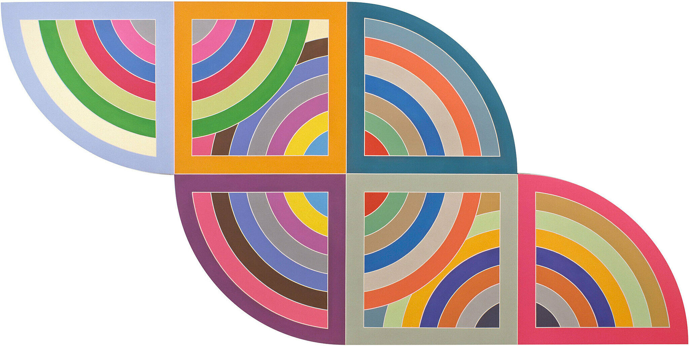

<h1>CSC 475: Seminar In Computer Science (under construction)</h1>

<!--   -->

<!--  -->

<!--  -->
<!-- 

<a href="https://www.guggenheim.org/artwork/4003">Frank Stella <i>Harran II</i>, 1967</a>
 -->
 

<a href="https://www.moma.org/collection/works/66689">Roy Lichtenstein, <i>Peace Through Chemistry I</i>, 1970</a>

<!--  -->
<!-- 

<a href="https://en.wikipedia.org/wiki/Julie_Mehretu">Julie Mehretu <i>Retopistics: A Renegade Excavation</i>, 2001</a>
 -->
<!--  -->
<!-- 
<a href="https://www.guggenheim.org/artwork/4003">Frank Stella <i>Harran II</i>, 1967</a>
 -->

## Announcements

{: .deadline }
Assignment 1 due _September 1st_
